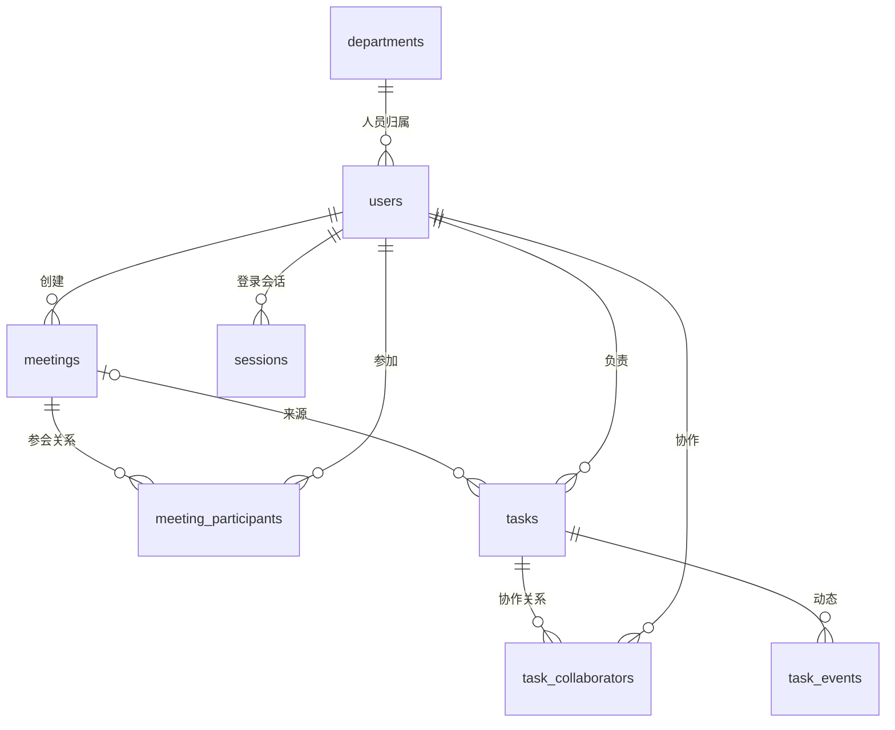

# 项目查找指南

本文件只解释目录、环境和已落地的数据结构。进度与设计决定统一维护在根目录 `doc.md`，AI 接续规则维护在 `codex.md`。

## 去哪里找代码

| 目的 | 位置 |
|---|---|
| 启动项目 | 根目录 README；后端 `backend/run.py` |
| 环境变量 | `backend/app/config.py`、`backend/.env.example` |
| 数据库连接与请求会话 | `backend/app/database.py` |
| 部门和人员表 | `backend/app/models/people.py` |
| 会议与参会关系 | `backend/app/models/meetings.py` |
| 任务、协作人、动态 | `backend/app/models/tasks.py` |
| 登录会话表、密码摘要 | `backend/app/models/auth.py`、`backend/app/security.py` |
| 建表/修改表的版本记录 | `backend/migrations/versions/` |
| 本地建库和演示初始化 | `backend/scripts/` |
| 后端测试 | `backend/tests/` |
| AI 输出契约、适配器与提示词 | `backend/app/ai/contracts.py`、`adapters.py`、`prompts.py` |
| 人员/日期/来源校验 | `backend/app/ai/resolution.py` |
| LangGraph 分析与恢复 | `backend/app/ai/workflow.py` |
| 前端页面与样式 | `frontend/src/` |
| 依赖与环境 | `backend/requirements.txt`、`frontend/package-lock.json`、根目录 `environment.yml` |
| 工具缓存与临时产物 | `work/`，不属于应用源码 |

后续接口、参数模型、业务逻辑分别放入 `backend/app/api/`、`schemas/`、`services/`。需要时创建实际模块，不提前堆积空目录或通用框架。业务名在这些目录中保持一致，便于沿着接口查到业务与数据库。

## Python 环境怎么选

`.venv` 是 Python 自带的轻量虚拟环境，隔离 Python 包；Conda 还可以管理 Python 版本和非 Python 依赖。它们能分别运行本项目，同一个进程只选择一个环境，不把两个环境叠加激活。[Python 文档](https://docs.python.org/3.12/library/venv.html)、[Conda 文档](https://docs.conda.io/projects/conda/en/stable/user-guide/tasks/manage-environments.html)。

当前使用已经验证的 `.venv`（Python 3.12.10），无需重装。老师要求 Conda 时，在根目录执行：

```powershell
conda env create -f environment.yml
conda activate meetingflow
python -m pip check
python backend/run.py
```

`environment.yml` 用 Conda 提供 Python 3.12，再用 pip 安装同一份锁定依赖。PyCharm 选择新建的 `meetingflow` Conda 解释器即可。实际环境位置用 `conda env list` 查询；迁移环境时重建依赖，不复制 `.venv` 文件夹。当前未实际创建该 Conda 环境，现有 Miniconda 的 base 环境不用于安装项目依赖。

本机盘点：i5-13500HX（14 核/20 线程）、约 15.7 GB 内存、D 盘约 156 GB 可用空间；Python、Conda、Node/npm、Git、MySQL 均已有。当前调用外部模型 API 的原型不要求本地 GPU 推理环境。2026-09-11 已接入 DeepSeek 官方分析及问答、本地 Whisper base 和 BGE-small-zh-v1.5；本机 RTX 4060 Laptop 8GB 暂不用于推理。

## 当前数据关系



T02 最初建立 8 张业务表；目前迁移到 `0009`，追加会议输入、分析结果、作业和候选事项，加上部门邀请及部门参会安排及分片、录音元数据共 16 张业务表，加上 Alembic 版本表。任务以唯一 candidate_id 关联候选，发布与重试不会重复生成。分片和录音表分别在 0007/0008 增加，0009 追加向量、转写状态和输入关联字段。部门不授予数据可见权限；负责人只有一位，协作关系单独保存。演示数据中的王五是未参会协作人，李四是仅参会人员，赵六是无关员工，便于后续测试区别。

内部时间保存为 UTC 的 MySQL DATETIME(6)，Python 读取后恢复 UTC 时区；写入没有时区的时间会被拒绝。外键不做级联删除人员或会议；任务软删除字段预留，实际接口与过滤规则按开发清单实现。账号使用唯一登录名，显示姓名可以相同。

## 数据库与测试命令

首次建立空库，在 `backend` 中执行：

```powershell
..\.venv\Scripts\python.exe -m scripts.configure_database
..\.venv\Scripts\python.exe -m alembic upgrade head
..\.venv\Scripts\python.exe -m scripts.seed_demo --random-password
```

配置脚本隐藏输入 MySQL 密码，成功后写入本地 `.env`；若发现目标库已有表，会停止，不清空已有库。当前库已建立，不需重复运行配置脚本。

随机演示密码位于本地 `backend/.env.demo`，登录名为 `boss`、`zhangsan`、`lisi`、`wangwu`、`zhaoliu`。也可以不带 `--random-password`，通过隐藏输入指定至少 8 位的演示密码。再次初始化保留已有密码和人工编辑，不是重置密码命令。演示初始化按本地单次串行使用设计。

```powershell
..\.venv\Scripts\python.exe -m alembic current
..\.venv\Scripts\python.exe -m alembic check
..\.venv\Scripts\python.exe -m pytest -q -p no:cacheprovider
```

测试连接本地 MySQL，每个数据库测试运行在外层事务中并回滚，不清库；自增 ID 可能留下空隙，这是正常行为。它验证数据库约束与规则，不能代替后续 HTTP 权限或真实 AI 验收。

## 本轮新增入口（T11—T13）

- 候选发布：backend/app/models/candidates.py、app/services/candidates.py、app/schemas/candidates.py、app/api/candidates.py。任务创建的事务内公共插入函数在 services/tasks.py。
- 完整流程：app/services/jobs.py 的 submit_text_input 同事务保存输入和作业，app/ai/workflow.py 执行分析与发布。迁移 0004 是候选及唯一关联，0005 是作业范围。
- 前端：src/api/ 请求和字段；src/stores/session.ts 会话；src/router.ts 路由；src/views/ 页面；src/components/ 列表组件；src/utils/ 日期。
- 浏览器检查：frontend/scripts/smoke.mjs；运行 npm.cmd run test:smoke。读取本地演示密码但不输出、不保存浏览器登录态；使用独立临时 Chrome 窗口，不操作用户现有浏览器会话。
- 当前正常运行方式：后端一个进程，自动工作器随应用启动；frontend 开发服务单独启动。迁移需在后端启动之前完成。

## 文本演示版新增入口（T14—T23）

- 试用先读 docs/demo-guide.md；当前真实模型状态及试用入口以 README 为准；本节保留最初演示版入口。
- 会议页面：frontend/src/views/MeetingsView.vue、MeetingDetailView.vue；任务页面：TasksView.vue、TaskDetailView.vue；共享表单 components/TaskForm.vue；人员目录 composables/useDirectory.ts。
- 人员管理与只读助手：views/PeopleView.vue、AssistantView.vue。
- 固定分析样例：backend/app/ai/demo.py；配置开关在 app/config.py，默认 demo；前端通过 /api/analysis-config 获取明确模式。
- 助手状态图：app/ai/assistant.py；授权工具和关键词 SQL 在 app/services/assistant_tools.py；接口与响应在 app/api/assistant.py、app/schemas/assistant.py。查询只读取当前版本及授权范围；2026-09-10 改为读取 meeting_chunks 持久化分片。
- 新增后端测试：tests/test_demo.py、test_assistant.py；完整回归 134 项通过。前端 scripts/business-smoke.mjs 和 admin-assistant-smoke.mjs 使用真实接口并保留专用演示数据，详见演示指南。
- 新演示会议中的李四经补充成为测试用例任务负责人；角色标签是具体数据场景，不表示该账号永远仅参会或永远没有任务。

## 部门负责人新增入口（T26—T28，2026-09-09）

- 角色为 MANAGER，仍复用 User.department_id，不引入组织树；权限在 backend/app/permissions.py。
- 部门会议邀请：models/meetings.py 的 MeetingDepartment；部门安排：MeetingDepartmentParticipant。组织者直接点名继续保存于 MeetingParticipant。有效参会人统一计算，人员解析、列表、详情和助手复用权限。
- 部门名单服务：app/services/meeting_attendance.py；接口 PATCH /api/meetings/{id}/departments/{department_id}/participants。经理只维护本部门名单，不能修改 Boss 直接点名。
- 页面组件：frontend/src/components/DepartmentAttendance.vue；会议创建与编辑增加邀请部门，人员管理增加部门负责人角色，任务详情操作能力由后端返回。
- 迁移 0006 增加两张表及经理部门约束，14 张业务表。已有经理时回退迁移会被数据库拒绝，不静默降级账号；不要对演示库随意运行 downgrade。
- 初始化：backend/scripts/seed_managers.py；检查：backend/tests/test_managers.py、frontend/scripts/manager-smoke.mjs。完整后端回归 145 项通过，经理浏览器流程通过。

## 分片检索与录音基础（2026-09-10）

- 数据：backend/app/models/knowledge.py 的 MeetingChunk 关联 MeetingInput；models/audio.py 的 MeetingAudio 关联 Meeting。音频独立保存；0009 增加转写状态、文本和关联输入。
- 索引：app/services/knowledge.py 按 600 字/100 字重叠保存精确原文切片；services/meetings.py 保存新输入时一起落库。旧库迁移后运行 `python -m scripts.index_meetings` 回填，不覆盖原文和任务。
- 来源：services/assistant_tools.py 先通过 SQL 限定会议权限及最新版本，再查片段；api/meetings.py 的 chunks 详情校验会议、输入及片段的对应关系。助手输出增加 input_id/input_version/chunk_id/start_offset/end_offset。
- 音频：services/audio.py 与 api/audio.py，原始请求流按实际字节限制大小，基础文件头验证，随机名称私有保存，下载时复用会议全文权限；读取流和文件响应采用已有 Starlette 能力，不增加依赖。参考 [Request.stream](https://www.starlette.io/requests/) 和 [FileResponse](https://fastapi.tiangolo.com/reference/responses/)。
- 配置：audio_storage_dir 默认 backend/storage/audio，audio_max_mb 默认 50；asr_mode=local 时上传自动转写，`/transcribe` 支持重试；未配置时返回 503。转写状态保存在 MeetingAudio，独立工作器恢复排队结果。
- 前端：components/MeetingRecording.vue 管理文件选择/上传/下载；MeetingSource.vue 按查询参数读取引用并显示历史版本。AssistantView.vue 链接到具体片段。
- 验证：backend/tests/test_knowledge.py、test_audio.py 共新增 15 项，完整后端 160 项通过。frontend/scripts/knowledge-audio-smoke.mjs 可通过 `npm.cmd run test:knowledge-audio` 复验，保留明确标注的演示会议与静音 WAV。

## 真实模型新增入口（2026-09-11）

- 分析 API：backend/app/ai/deepseek.py；本地 CPU 模型：ai/local_models.py；下载：scripts/download_models.py。版本锁定 faster-whisper 1.2.1 / fastembed 0.8.0。
- 转写事务及旧版本保护：services/transcription.py；单进程转写恢复：ai/audio_worker.py；应用在 main.py 启动两个工作器。
- 语义检索：services/semantic_search.py；模型 JSON 查询计划及只读图：ai/assistant_live.py。先用 SQL 权限过滤，再取正文并计算向量，不把身份交给模型决定。
- 测试：tests/test_live_models.py；conftest.py 强制无收费模式。最新完整回归 168 项通过，早期章节数量仅对应当时阶段。
- 独立空库验证：scripts/verify_clean_database.py，需要当前数据库用户拥有建库权限，仅删除本次随机生成的专用临时库；本机已通过，无需普通启动时执行。
- 真实 Chrome 验证：frontend/scripts/live-model-smoke.mjs，显式付费入口，使用 work/asr-spoken-validation.wav 合成短语音，复用 work/live-validation.json 避免重复问答费用。新环境没有该临时样本时不直接运行。
- 结果及边界统一见 docs/model-validation.md；完整启动、费用开关及排错见 README。
